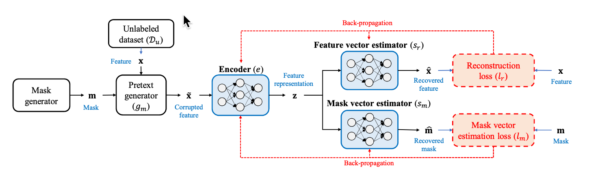
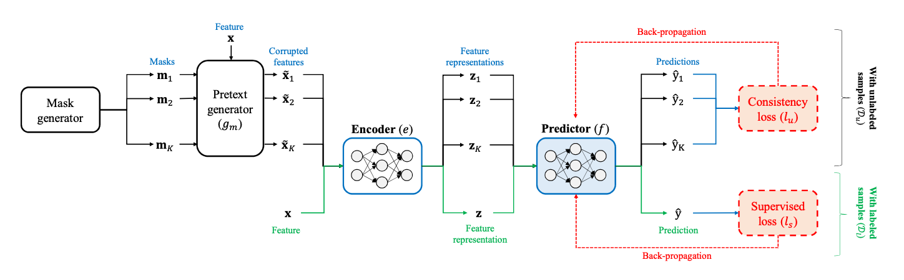

# VIME - PyTorch

This repo reproduces VIME framework for self- and semi-supervised learning to tabular domain.

*Authors: Jinsung Yoon, Yao Zhang, James Jordon, Mihaela van der Schaar*

*Reference: Jinsung Yoon, Yao Zhang, James Jordon, Mihaela van der Schaar, "VIME: Extending the Success of Self- and Semi-supervised Learning to Tabular Domain," Neural Information Processing Systems (NeurIPS), 2020.*

Original paper: https://proceedings.neurips.cc/paper/2020/hash/7d97667a3e056acab9aaf653807b4a03-Abstract.html

Original repo: https://github.com/jsyoon0823/VIME/tree/master

---------
## About

### Initial Implementation

This initial implementation follows the VIME self-supervised framework to train an encoder on
unlabeled MNIST data, which is then used to train a semi-supervised MLP on a much smaller portion
of labeled MNIST data. The final model is tested against the standard MNIST test set.

<figure>
  
  <figcaption>Block diagram of the proposed self-supervised learning framework on tabular data. Credit: Yoon et al.</figcaption>
</figure><br>


The final model used only 10% of MNIST training set (n=6,000) as labeled data for the semi-supervised
learning and reached 93% classification accuracy on the test set.  None of the hyperparameters were 
optimized for this initial work. 

<figure>
  
  <figcaption>Block diagram of the proposed semi-supervised learning framework on tabular data.. Credit: Yoon et al.</figcaption>
</figure><br>


Full configuration listed in `outputs/vime-encoder/train_self/2023-05-26/10-09-22/.hydra/config.yaml`
for the self-supervised encoder and in `outputs/vime-learner/train_semi/2023-05-26/10-32-51/.hydra/config.yaml`
for the semi-supervised learner.

## Install

Clone this repository, create a new Conda environment and 

```bash
git clone https://github.com/chris-santiago/vime.git
conda env create -f environment.yml
cd vime
pip install -e .
```

## Use

### Prerequisites

#### Task

This project uses [Task](https://taskfile.dev/) as a task runner. Though the underlying Python
commands can be executed without it, we recommend [installing Task](https://taskfile.dev/installation/)
for ease of use. Details located in `Taskfile.yml`.

#### Current commands

```bash
> task -l
task: Available tasks for this project:
* check-config:       Check Hydra configuration
* train-multi:        Launch multiple training jobs
* train-self:         Train the VIME encoder module
* train-semi:         Train the VIME semi-SL module
* wandb:              Login to Weights & Biases
```

#### PDM

This project was built using [this cookiecutter](https://github.com/chris-santiago/cookie) and is
setup to use [PDM](https://pdm.fming.dev/latest/) for dependency management, though it's not required
for package installation.

#### Hydra

This project uses [Hydra](https://hydra.cc/docs/intro/) for managing configuration CLI arguments. See `vime/conf` for full
configuration details.

#### Weights and Biases

This project is set up to log experiment results with [Weights and Biases](https://wandb.ai/). It
expects an API key within a `.env` file in the root directory:

```toml
WANDB_KEY=<my super secret key>
```

Users can configure different logger(s) within the `conf/trainer/default.yaml` file.

### Training

- Run `task train-self` to train the self-supervised encoder. Once complete, check the `outputs/vime-encoder/train_self/../checkpoints`
directory for path to saved checkpoint. 
- Copy and paste this checkpoint into the semi-supervised model 
config, located at `conf/model/learner.yaml` under the `nn.encoder_ckpt` key.
- Run `task train-semi` to train the semi-supervised encoder. 

All results will populate to their respective output directories:

```
├── outputs
│   ├── vime-encoder
│   │   └── train_self
│   │       └── 2023-05-26
│   │           └── 10-09-22
│   │               ├── .hydra
│   │               ├── checkpoints
│   │               └── wandb
│   └── vime-learner
│       └── train_semi
│           └── 2023-05-26
│               ├── 10-32-51
│               │   ├── .hydra
│               │   ├── checkpoints
│               │   └── wandb
```

## Documentation

Documentation hosted on Github Pages: [https://chris-santiago.github.io/vime/](https://chris-santiago.github.io/vime/)
